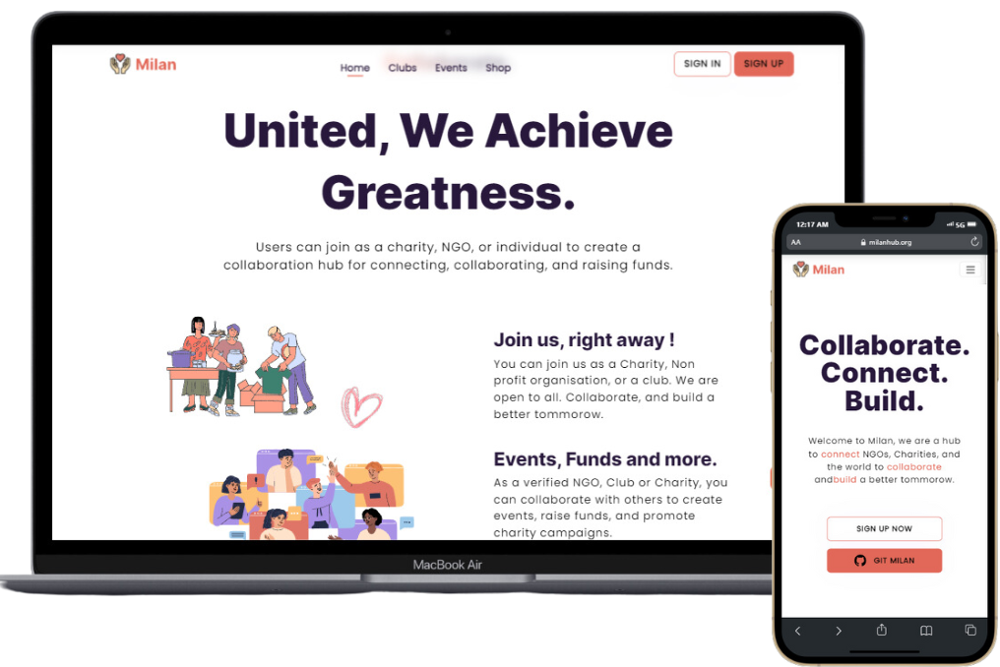

  

# What is NgoWorld ?

NgoWorld is a hub to **connect** NGOs, Charities, and the world to **collaborate** and **build** a better tomorrow. Sign up as an organization/user and be a cause for change. Don't forget to drop a star ⭐.

 

 

 

# Tech Stack (Frontend) 💻

    
    
    
    
    
    
    
    
    
    
    
    
    

 

# Contributing to NgoWorld 🔐

Remember, Good PR makes you a Good contributor !

We at NgoWorld work hard to maintain the structure, and [use conventional Pull](https://github.com/ngoworldcommunity/NGOWorld/blob/main/CONTRIBUTING.md#pull-request-title-format-) request titles and commits. Without a proper template for the PR, not following the guidelines and spam might get the pull request closed, or banned.

## 1️. Setting up the project locally

- [Forking + Cloning Guide](/docs/CloneSetup.md)
- [Setting up the Frontend (current repo)](/docs/FrontendSetup.md)
- [Setting up the Backend](https://github.com/ngoworldcommunity/NGOWorld-Backend/blob/main/docs/BackendSetup.md)
- [Setting up with docker](/docs/DockerSetup.md)

## 2️. Contributing guidelines & more

- [Contributing Guidelines](/CONTRIBUTING.md) to be followed.
- [Proper API documentation](https://milan-server.onrender.com/docs/) for developers.

# License 👮

NgoWorld is Licensed under the <a href="./LICENSE">MIT License</a>. Please go through the License at least once before contributing.

# Support 🙏

**Don't forget to drop a star ⭐.** A heartfelt thank you to those who have contributed to this project. We are really grateful for your contribution. You all are amazing. Opensource for the win 🚀
